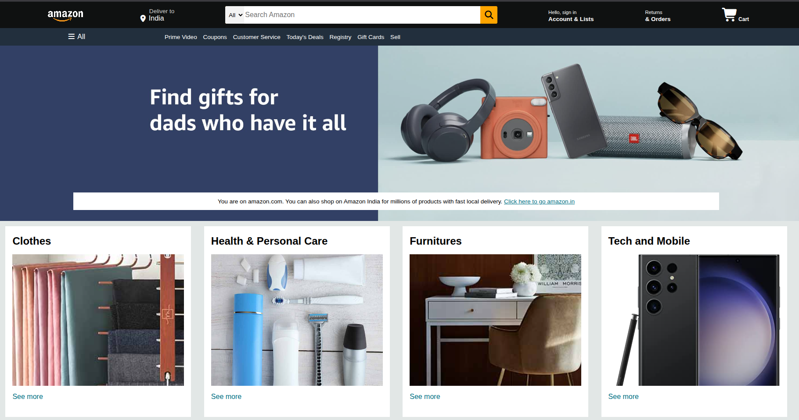
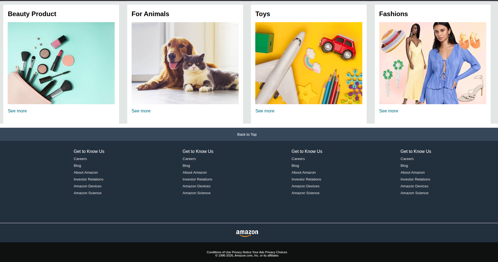

# amazon-clone-html-css
Amazon homepage clone built using HTML and CSS.
# 🛒 Amazon Clone

A frontend Amazon clone built using HTML and CSS.

## 🌐 Live Demo

[View Live Website](https://abhinavsri2810.github.io/amazon-clone-html-css/)

## 📸 Preview

## 🛠️ Technologies Used

- HTML5
- CSS3

## ✨ Features

- Amazon-inspired navigation bar
- Hero section
- Product sections
- Product cards
- Footer
- Responsive design

## 🚀 How to Run Locally

1. Clone the repository
2. Open `index.html` in your browser